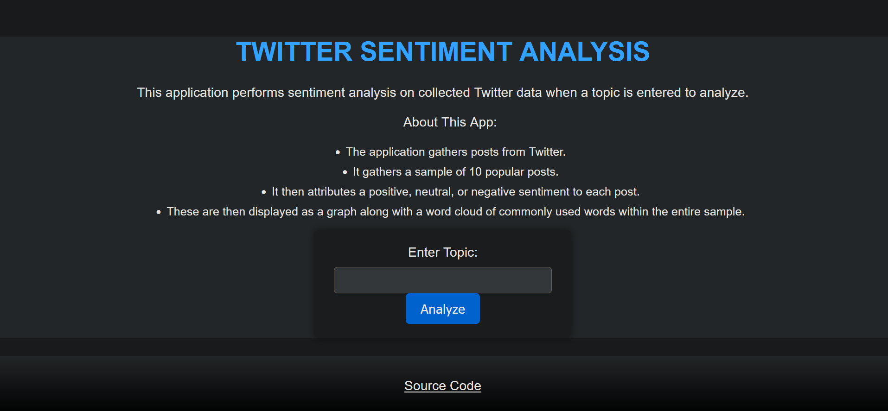

# xanalysis website
This website uses sentiment analysis in order to allow somebody to search Twitter for a keyword topic. The site returns the sentiment scores via a graph. A word cloud is also included in order to visualize the most common words being used in order to get a sense of what the sentiment analysis algorithm is reacting to. 

Once a topic is entered, the sentiment graph and the word cloud are displayed. For the mostpart, any topic can be searched! I often use corporations or financial keywords as examples/

# Technologies

I use Flask as my go-to frontend web framework at the moment. It is simple to work with and creates solid results.

In order to perform the web scraping aspects of this project, I used ScraperAPI's service. Documentation can be found below!

https://www.scraperapi.com/documentation?fp_ref=jamison56
